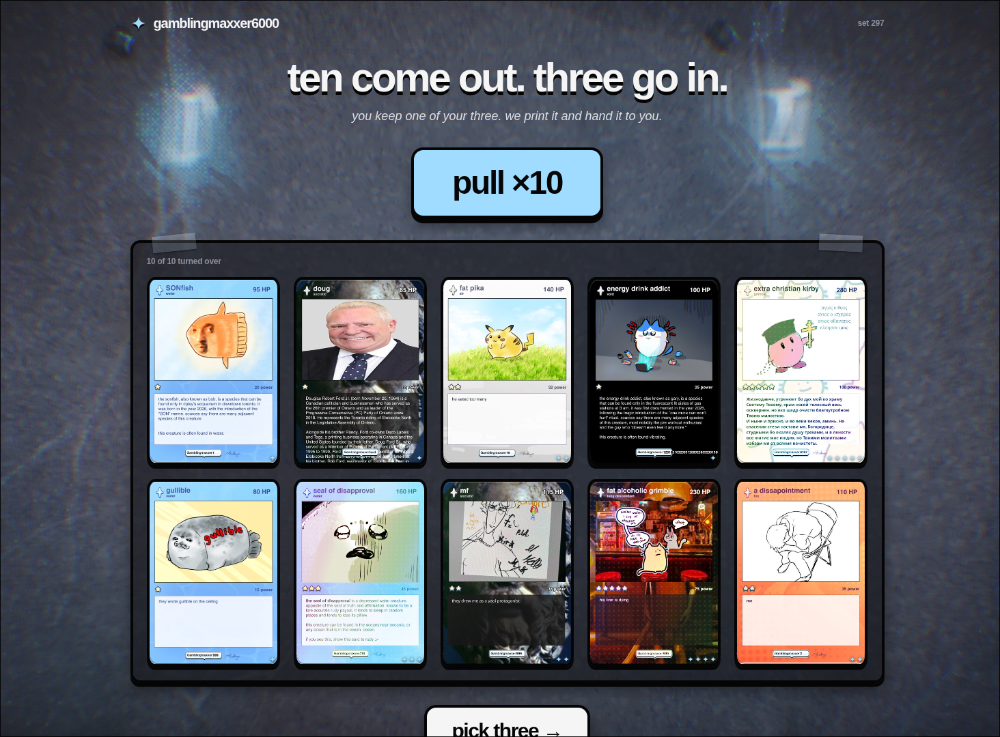

# gamblingmaxxer6000

A Polaris project by Gabe, Jenin and Kat

## premise

> What shifts today may become the foundation of tomorrow.

The underlying system behind most real-life gambling is the idea that the odds are fundamentally equal with every chance.
This should equalize people. Instead, it makes them broke alcoholics.

Gacha gambling, on the other hand, often operates with what's known as **pity**. The idea that if you do not win enough,
your sunk cost will still be helpful -- spend a hundred pulls without getting your desired five-star and your next pull
will be guaranteed to be one. Fudging the odds based on your failure, so to speak. What is inaccessible "today" becomes
accessible "tomorrow".

Gamblingmaxxer6000 operates under a similar philosophy. The underlying mechanic is pulling for cards, evidently. 
Every time you pull a card of a certain value or type, the next round's odds for pulling different values or types 
will increase.

The core functionality is this pulling. But, you also select a subset of your pulled cards to create your battlesquad in the
proverbial fight club. The remainder is selected to battle against you. There are cool animations that Jenin did for the 
fighting.

## pity system
- pull common cards
- the game's RNG has pity on you and increases the chances of rarer cards on your next pull
- pull rare cards
- the game's RNG stops having pity on you and decreases the chances of rarer cards on your next pull


## technicalities

The project was made on Sveltekit as its basis. TypeScript was used extensively. All battle, pull calculations are handled 
on the backend. In my opinion, there's not much to say here.

## running locally

prerequisites:
- Node.js 20+
- npm

```bash 
git clone https://github.com/gbtsui/gamblingmaxxer6000.git
cd gamblingmaxxer6000
npm install
npm run dev
```

open `http://localhost:5173`

## credits

### gabe
- backend
- frontend (prototyping)
- art (bad)
### jenin
- backend
- frontend (final)
- animations
### kat
- art (good)
- UI
- visual design

> > "i dont even know why i code anymore"
>
> because you do it for the art you don't just do it for the output
> - @anirudh

